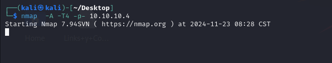
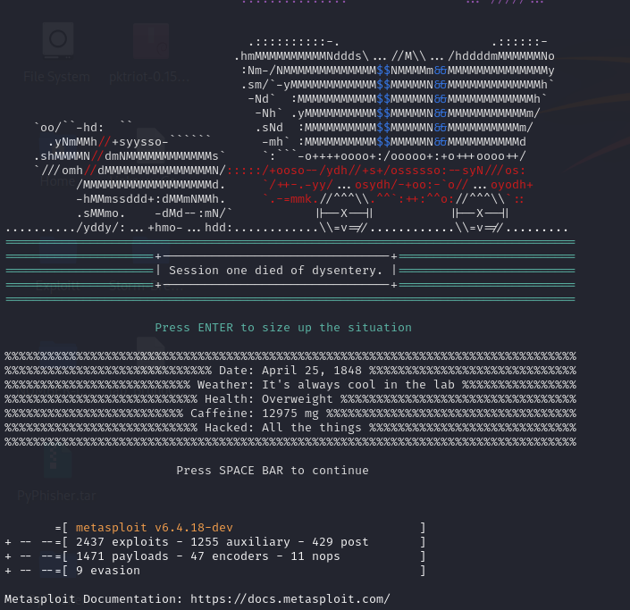
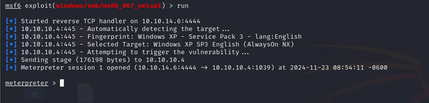

# HTB Legacy Machine

## RECON 

### NMAP 

I launched an nmap scan to all the ports.

After the scan is possible to see the  3  ports open.

* 139
* 135
* 445

PORT    STATE SERVICE      REASON  VERSION
445/tcp open  microsoft-ds syn-ack Microsoft Windows XP microsoft-ds

PORT    STATE SERVICE     REASON  VERSION
139/tcp open  netbios-ssn syn-ack Microsoft Windows netbios-ssn

PORT    STATE SERVICE REASON  VERSION
135/tcp open  msrpc   syn-ack Microsoft Windows RPC

Running on por 445 wi find a vulnerability **CVE-2008-4250**

**The Server service in Microsoft Windows 2000 SP4, XP SP2 and SP3, Server 2003 SP1 and SP2, Vista Gold and SP1, Server 2008, and 7 Pre-Beta allows remote attackers to execute arbitrary code via a crafted RPC request that triggers the overflow during path canonicalization, as exploited in the wild by Gimmiv.A in October 2008, aka "Server Service Vulnerability."**

I find an exploit in Metasploit

**ms08_067_netapi**

## Explotation

I get a Meterpreter Session 

We find the firs flag on user John 

$$$$$$$$$$$$$$$$$$$$$$6876f4f

We find Root flag 

993442$$$$$$$$$$$$$$$$$$$$$$$

This is a very easy Machine.

Happy Hacking 😏.

